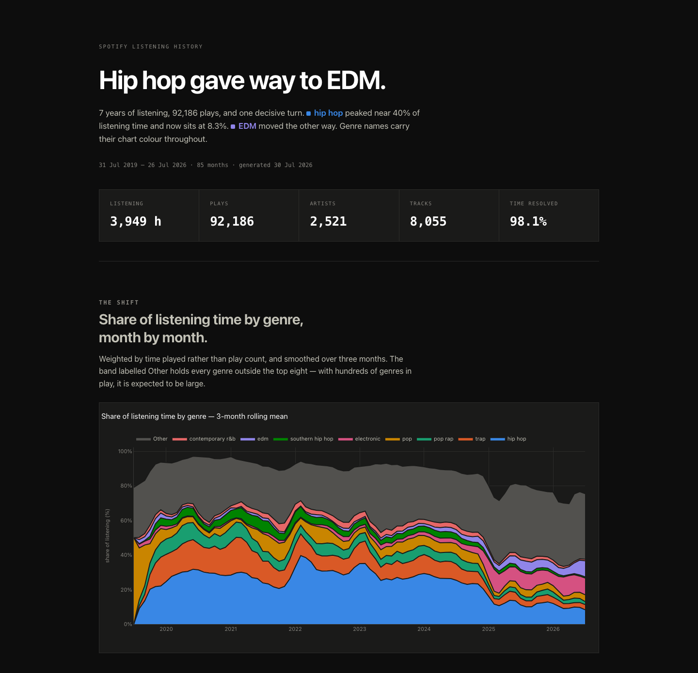

# Spotify Listening History — Trend Analysis

Take your own Spotify Extended Streaming History export, turn it into a queryable
DuckDB + Parquet dataset, and find out **which direction your taste is actually
moving** — which genres are climbing, which are quietly dying, and what you'd
probably like next if the trend keeps going.

Everything runs locally. Your listening history never leaves your machine and
never enters git.

The end product is a single self-contained HTML file you can open offline, plus
an interactive dashboard if you'd rather poke at it:

```
.venv/bin/python report.py --open          # → output/report.html
.venv/bin/streamlit run app.py --server.address 127.0.0.1
```



*The report opens on whatever the biggest shift in your history turns out to be —
the headline is generated from your data, not written in advance. Above is the
author's; yours will say something else. It renders in light or dark to match
your system.*

## What it answers

- **What has my listening actually been made of, month by month?** Share of
  listening *time* per genre, not play counts — a track you sat through counts
  more than one you skipped at 31 seconds.
- **What's rising and what's dying?** Each genre gets a trailing-12-month slope
  and a `rising` / `declining` / `flat` classification, gated so a genre sitting
  at 0.1% can't post "+540% a year" off a rounding error.
- **Where is it heading?** A damped projection of each genre's share, plus a gap
  analysis: genres climbing fast that you've barely explored.
- **What should I listen to next?** A recommender scored against where your taste
  is *going* rather than where it has been — see [Stage 5](#stage-5--trajectory-aware-recommendations),
  which is the part of this repo with an actual idea in it.
- **How has my discovery changed?** New artists per month, how concentrated your
  listening is in your top 1% of artists, and skip rate by genre.

For scale, the author's library runs 92,186 music plays across 2,521 artists over
seven years — about 3,950 hours. Numbers quoted throughout are from that dataset
and are there to show what the output looks like, not because yours will match.

## 1. Get your data out of Spotify

This is the slow part, so start it now.

Go to **[spotify.com/account/privacy](https://www.spotify.com/account/privacy/)**
and request **Extended streaming history**. Not "Account data" — that one is a
different, much smaller download capped at roughly the last year, and it will not
work here.

Spotify says up to 30 days; in practice it's usually a few days. You'll get an
email with a zip containing files named `Streaming_History_Audio_YYYY-YYYY_N.json`
(plus video and podcast files, which the pipeline handles and filters).

Unzip it into the project root so you have:

```
spotify-trend-analysis/
└── Spotify Extended Streaming History/
    ├── Streaming_History_Audio_2019-2021_0.json
    └── ...
```

Or put it anywhere and set `SPOTIFY_EXPORT_DIR` in a `.env` file — see
`.env.example`.

## 2. Install

Python 3.12. Everything runs through a project-local virtualenv; no global installs.

```bash
git clone https://github.com/UncannyJ33/spotify-trend-analysis.git
cd spotify-trend-analysis
python3.12 -m venv .venv
.venv/bin/pip install -r requirements.txt
```

Six dependencies: DuckDB, requests, Plotly, Streamlit, pandas, python-dotenv.
No API keys are required for anything except the optional Stage 6 poller.

## 3. Run it

```bash
.venv/bin/python ingest.py        # seconds     — read the export, normalise, de-dupe
.venv/bin/python credits.py       # seconds     — recover featured artists from track titles
.venv/bin/python enrich.py        # ~1 hr/3k artists — genre tags from MusicBrainz (network)
.venv/bin/python analyze.py       # seconds     — monthly genre shares, trends, slopes
.venv/bin/python report.py --open # seconds     — the HTML report
```

Run those five in order the first time. **Stage 2 (`enrich.py`) is the long one**
— it's throttled to one MusicBrainz request per second because that's their rate
limit, so budget roughly an hour per 3,000 distinct artists. It is fully
resumable: every resolution is appended to `.cache/` and fsynced, so Ctrl-C and
re-run picks up exactly where it stopped, and later re-runs only spend requests
on artists they've never seen. You can also cap a session with `--limit 200`.

Every stage prints a report when it finishes — row counts, coverage, what got
dropped and why. Read it. That output is how you know a stage worked; for these
pipeline stages there's no test suite standing between you and a silently wrong
number. The stages that write to Spotify do have one — see
[the tests](#the-tests).

Then the optional extras:

```bash
.venv/bin/python recommend.py     # who to listen to next (network)
.venv/bin/python forecast.py      # projection + under-explored genre gaps
.venv/bin/python poll.py          # keep history current between exports (network, needs a Spotify app)
```

Re-run `report.py` afterwards and those sections appear in the HTML. Everything
downstream of Stage 3 degrades gracefully — if you skip the forecast, the report
simply omits that section rather than failing.

### Refreshing later

Request a fresh export every few months, drop it in, and run stages 1 → 4 again.
Ingestion is idempotent: the same export produces byte-identical files, and a
newer one just picks up the new plays. There's no incremental state to drift, and
no scheduler — this is built for occasional manual re-runs, not continuous
operation.

### All commands

| Stage | Command | Output |
|-------|---------|--------|
| 1. Ingest | `python ingest.py` | `data/plays_raw.parquet`, `data/plays.parquet` |
| 1b. Credits | `python credits.py` (`--review`) | `data/track_credits.parquet` |
| 2. Enrich | `python enrich.py` (`--limit N`, `--report`, `--retry-errors`) | `data/artist_tags.parquet`, `.cache/` |
| 3. Analyse | `python analyze.py` | `data/tag_trends.parquet`, `data/secondary/*` |
| 4. Dashboard | `streamlit run app.py --server.address 127.0.0.1` | interactive |
| 4b. Report | `python report.py` (`--open`) | `output/report.html` |
| 5. Recommend | `python recommend.py` (`--lambda N`, `--top N`) | `data/recommendations.parquet` |
| 6. Poll | `python poll.py` (`--status`, `--logout`) | `data/polled_plays.parquet` |
| 7. Forecast | `python forecast.py` (`--horizon N`) | `data/forecast.parquet`, `data/genre_gaps.parquet` |
| 8. Playlists | `python playlists.py` (`--dry-run`) | 4 Spotify playlists + `data/playlists.parquet` |
| 9. Consolidate | `python consolidate.py --keep-whole N --filter N` (`--write`) | one new Spotify playlist + `data/consolidate_review.csv` |

All prefixed with `.venv/bin/`. Stages 2, 5 and 6 use the network; the rest are local.

**Bind the dashboard to localhost.** Streamlit listens on every interface by
default and prints an external URL on your public IP. This page renders your
personal listening history, so `--server.address 127.0.0.1` is part of the
command rather than an optional extra. Drop it only if you actually want the page
reachable from your LAN.

## 4. Reading the output

The report opens with your headline numbers and a stacked area chart of your top
genres over time. Some notes on how to read the rest without fooling yourself:

**Shares, not hours.** Every genre number is a share of that month's listening
time. A genre can "decline" while you listen to exactly as much of it, because
something else grew. That's usually the honest framing of taste — attention is
zero-sum — but it means a falling line is not proof you stopped listening.

**Smoothing is on by default.** Raw monthly shares are unreadable noise,
especially in months you barely listened. A 3-month rolling mean is applied
before anything is plotted. The dashboard has a toggle if you want the raw series.

**`rising` / `declining` / `flat` / `negligible`.** Classification comes from the
trailing-12-month slope of the smoothed share, relative to the genre's own size,
so a 2% genre and a 30% genre are judged on the same footing. Anything averaging
under 0.5% of your listening is classed `negligible` rather than given a trend —
without that floor the rankings fill with microscopic genres posting enormous
percentages off nothing. In the author's data that leaves 16 rising, 17
declining, 3 flat, and 475 genres correctly ignored.

**One play spreads across several genres.** Your time is split twice, and both
splits are normalised so listening time is never created or destroyed: first
across the performers on the track, then across each artist's genres in
proportion to how strongly MusicBrainz's community tagged them, capped at the top
8. So a play of one song adds fractions to several genres rather than picking a
winner.

**Featured artists are a toggle, not a decision.** Spotify's export credits only
the *album* artist, so features are invisible — in the author's data that hides
about 28% of listening time. `credits.py` recovers performers named in the track
title, and the dashboard lets you switch attribution on and off, because both
views are defensible. Both are computed and stored; the toggle costs nothing.

**The forecast is direction, not prophecy.** It extrapolates each genre's
trailing slope with a monthly damping factor and renormalises so shares still sum
to 1. Read it as "this is still climbing" or "this has topped out." An undamped
straight line would cheerfully predict 140% of your listening.

## 5. Your data stays local

`.gitignore` excludes the raw export, the zip it came in, every derived Parquet,
the enrichment cache, the rendered report and `.env`. Code and configuration are
tracked; your listening history is not.

The export contains an `ip_addr` field. It's dropped during Stage 1 and does not
exist in any derived artifact — Stage 1 asserts this and prints a privacy check
on every run.

Verify at any time:

```bash
git status --short                              # nothing from the export
git check-ignore -v "Spotify Extended Streaming History/"
```

Nothing is ever uploaded. The three network stages send only artist names and
MusicBrainz IDs to MusicBrainz and ListenBrainz; the poller talks to Spotify
about your own account. `output/report.html` contains your data — it's gitignored,
so think before you share the file itself.

## Design notes

The interesting parts, and the reasons they're built the way they are. If you're
cloning this to build something similar, these are the walls to know about before
you hit them.

### Stage 1 — Ingest and normalize

DuckDB reads the export JSON directly and writes Parquet. Nothing is staged
through pandas.

Two tables: **`plays_raw`** keeps every row unfiltered, because skip behaviour is
interesting on its own; **`plays`** is music only (`spotify_track_uri IS NOT NULL`,
which excludes podcasts and audiobooks) and real listens only
(`ms_played >= 30000`).

Idempotency is enforced by writing under a *total* row order (`ORDER BY ALL`). A
partial sort key leaves ties for DuckDB's parallel sort to break arbitrarily, and
byte-identical re-runs silently stop holding.

The export lists some events more than once. Since `ts` is the play *end* time,
an identical `(ts, ms_played, track)` triple cannot be two distinct listens, so
full-row duplicates are collapsed. Rows sharing that identity but differing in
other metadata are kept, and the count is reported.

### Stage 1b — Track credits

The export's only artist field is the album artist, so featured performers are
credited nowhere. In the author's data that hides about **28% of listening time**:
681 performers appear solely inside track titles and 407 never appear as an album
artist at all. `credits.py` parses `(feat. X)` / `(with X)` out of the title and
records one row per performer with a `credit_type`.

No weights are stored — Stage 3 decides what a feature is worth at query time, so
album-artist-only is simply the weight-0 case and stays available.

The regex only catches features named in the *title*; features living solely in
Spotify's track metadata stay invisible to it. Run `credits.py --review` to
eyeball what it extracted.

That guesswork is superseded wherever real data exists. If you run the
[Stage 6 poller](#stage-6--history-poller), every track it sees contributes its
true performer list, which replaces the parsed credits for all plays of that
track. The regex is the floor for tracks the poller has never seen.

### Stage 2 — Genre enrichment

One MusicBrainz search per artist yields both the MBID and a tag vector. Tags are
filtered against MusicBrainz's canonical genre vocabulary (~2,180 terms, fetched
once) because raw search tags carry noise like `usa`, `english`, `2010s` and
`gen z` alongside real genres.

Two deviations from the obvious design, both forced by the APIs:

- ListenBrainz's `bulk-tag-lookup` is keyed on **recording** MBIDs, not artist
  MBIDs, so it cannot consume an artist resolution. Using it would mean resolving
  every track to a recording MBID first — the per-track explosion this design set
  out to avoid.
- The search must query `artist:"X" OR alias:"X"` and *rank* the candidates rather
  than taking the first exact match. Searching the name alone silently loses every
  renamed artist — "Kanye West" returns a tribute band, because the entry is now
  "Ye" with the old name demoted to an alias. And an obscure artist holding a name
  as an *alias* can outrank the artist whose name it actually is: "Wale" returned
  a percussionist at score 100 ahead of the US rapper at 82. A primary-name match
  therefore beats an alias match.

Artists that resolve to an MBID but carry no tags are backfilled from their
**release-group** tags, which are frequently populated even when the artist page
is not.

**Spotify is not used as a fallback**, despite being the obvious candidate. Its
artist endpoint used to return a `genres` array and no longer does:
`/v1/artists/{id}` answers 200 with `genres`, `popularity` and `followers` all
absent (verified against Drake, Taylor Swift, Metallica and ArrDee), batch
`/v1/artists` and `/top-tracks` answer 403, and search never carried genres.
There is no genre data left there to fall back to. ListenBrainz's metadata lookup
would serve, but returns 401 without an Authorization header — the no-auth
guarantee covers only the `labs` host.

Resolution is strict — an exact normalised match against name or alias, never a
guess — and everything else lands on a review list you can inspect. Names are
folded on accents, case and stylisation so `A$AP Rocky` and `ASAP Rocky` collapse
together.

**Answering the review list.** Refusing to guess is right, but it needs a way to
hand an answer back. Copy `artist_overrides.example.csv` to
`artist_overrides.csv` and add a row per artist:

```csv
artist_name,mbid,note
Dave,<mbid>,UK rapper not Dave Matthews Band
21 Savage ft. Project Pat,IGNORE,unsplit feature string
```

An MBID pins that name to that artist and skips the search entirely. `IGNORE`
marks a name that is not an artist at all — regex artifacts and compilation
placeholders — so it stops surfacing on every future run. Run `enrich.py
--report` first: it ranks the review list by listening time, and only the top
few are worth a lookup. Overrides always win over the cache, take effect on the
next run, and deleting a row un-pins the artist and sends it back through normal
resolution. The file is gitignored, since it is a list of artists you listen to.

Judge the result by listening time, not artist count — one unresolved artist you
play constantly hurts more than a hundred you played once. The author's run
resolved 2,605 artists and sent 315 to review, which is **98.1% of listening time
resolved** to an MBID and **92.3% carrying usable genre tags** (resolution and
tagging are different things: MusicBrainz knows who plenty of artists are without
anyone having tagged them). `enrich.py --report` prints both for your data.

MusicBrainz is throttled to roughly 1 req/sec with a descriptive User-Agent; a
503 is answered with a real backoff, since MusicBrainz sends `Retry-After: 0` and
trusting it means no backoff at all.

### Stage 3 — Analysis

Share of listening time per tag per month, weighted by `ms_played`, under two
normalised weightings: a play's time splits across its performers, then each
artist's share splits across their genres by MusicBrainz vote count, capped at 8.

The cap matters. Ye carries 58 tags; splitting evenly would give each 1/58 while a
two-tag artist gives each a half, systematically burying well-tagged artists.

Trend classification gates on absolute size before computing relative change.
Without that floor a genre sitting at a fraction of a percent posts "+540% a year"
off a 0.3pp move and swamps the rankings.

`tag_trends.parquet` is the contract every downstream stage reads — long format,
keyed by `(variant, tag, month)`. If you want to build your own surface on top of
this, that's the table to query.

### Stage 4 — Output surfaces

Every chart lives in `figures.py` as a function returning a Plotly figure; the
dashboard and the report both import from it, so chart code is never written
twice.

`report.py` renders those same functions into `output/report.html` — one file, no
server, works from a `file://` URL with the network off. It lands around 4.8 MB.
Plotly is inlined **once**: passing `include_plotlyjs='inline'` per figure would
embed the ~3.5 MB library a dozen times over. Every figure is rendered twice,
light and dark, and CSS reveals whichever matches the reader's system, because a
baked-in Plotly figure cannot recolour itself.

Colour is anchored to the canonical global genre ranking rather than to list
position, so filtering out one genre never repaints the ones still on screen.

### Stage 5 — Trajectory-aware recommendations

A conventional recommender scores candidates against listening history, which
means it recommends your past back to you. The author's history is 30% hip hop
and that share is falling hard, so matching it points precisely where the
listening is leaving. Candidates are scored against a trajectory-weighted taste
vector instead:

```
weight(genre) = current_share x (1 + LAMBDA x relative_annual_change)
```

`LAMBDA = 2.0` was picked by sweep. At 0 the top ten holds six hip-hop artists
led by MC Eiht — gangsta rap being the fastest-declining genre in that library.
At 2 it holds none, led by Depeche Mode, while still grounded in real similarity.
`--lambda 0` is kept as the honest baseline; the dashboard exposes the dial and
re-ranks in ~0.03s because every input is cached locally. Try both — the
comparison tells you more about your own listening than either list alone.

Candidates come from ListenBrainz `similar-artists` — collaborative filtering
over real listening sessions, no auth. Spotify's equivalents are withdrawn:
`/v1/recommendations` returns 404, and `related-artists`, `top-tracks` and
`new-releases` return 403.

### Stage 6 — History poller

The export is a snapshot; without this everything freezes at its generation date.
Two limits belong to Spotify's `recently-played` endpoint and are surfaced rather
than hidden:

- **No play duration.** It reports `played_at` and full `duration_ms`, never how
  much was heard. Since the analysis weights by `ms_played`, polled rows carry an
  estimate flagged `ms_played_estimated`. Spotify only lists a track once it
  passes ~30s, so the estimate holds for the 30s floor but overstates anything
  abandoned at 45 seconds.
- **Fifty items, one page.** The author's history averages ~36 plays a day, so
  polling less often than daily silently drops plays. The run warns when a page
  comes back full — the signal that older plays fell off before it arrived.

When a real export later covers the same period, it supersedes every polled row
in that window, replacing the estimates with true durations.

Auth is Authorization Code with PKCE, so no client secret is used. **This is the
one thing that needs a Spotify developer app**: create one at
[developer.spotify.com](https://developer.spotify.com/dashboard), set its
redirect URI to exactly `http://127.0.0.1:3000`, and put the client ID in `.env`
as `SPOTIFY_CLIENT_ID`. Nothing else in the pipeline needs credentials.

**It also repairs the export's worst flaw.** The endpoint returns the real
*track* artists, which the export does not have at all. Stage 1b uses that: any
track the poller has seen even once gets its true credits applied to **every**
play of it, including export rows from years earlier. Since you replay tracks,
one polled listen can fix a decade of misattribution for that track — and the
poller's answer replaces the title-regex guess outright rather than merging with
it.

The trade-off is deliberate: credits now depend on poll state as well as the
export, so historical genre shares shift slightly as the poller learns more
tracks. The alternative was freezing the export period on known-wrong data
forever. Both `credits.py` and the `track_credits` table record a
`credit_source` of `export` or `poller` so you can always see which is which.

### Stage 7 — Forecast and gaps

Projects each genre's share forward under its trailing slope, damped by
`MOMENTUM_DECAY` per month and renormalised. A straight-line extrapolation of a
share would happily predict 140% of listening; read the output as direction and
rough magnitude, not as a model.

The gap analysis finds genres climbing fast while served by few artists — where
your listening is already heading but has barely explored — and joins them to
Stage 5's candidates. Ranked rather than cut at a fixed artist count, because the
thinnest-served rising genre in the author's data still has 13 artists, so any
hard threshold either admits everything or nothing.

### Stage 8 — Gap playlists

Turns the gap analysis into something you can press play on: one playlist per
top gap genre, capped at four.

**`playlist_overrides.csv` overrules the ranking when you need it to.** The gap
ranking answers "where is your listening heading", weighted by seconds — and
seconds are dominated by whatever plays during a workout, where music is a
metronome rather than a choice. The export records no activity type at all
(platform is 95% mobile either way; `reason_start` can't separate a restless
desk session from a skip-heavy run), so no amount of analysis recovers the
difference. This file is where a human supplies what the data does not contain,
exactly as `artist_overrides.csv` answers Stage 2's review list. It's gitignored
— it's a statement of taste — with a tracked `playlist_overrides.example.csv`
documenting the format:

```csv
label,tags
shoegaze,shoegaze|dream pop
ambient,ambient|drone|field recording
```

`tags` is pipe-separated and an artist qualifies by carrying any of them, so a
playlist can span related genres. That does two jobs: it blends genres that only
make sense apart from each other, and it rescues a genre whose candidate pool is
too thin to fill `PLAYLIST_SIZE` on its own. In the author's data one gap genre
had just 6 candidate artists — a hard ceiling of 16 tracks at two per artist —
and widening it to four neighbouring genres took it to 18 artists and a full
playlist. Widening beats raising `TRACKS_PER_ARTIST`, which just lets one act
take four of your twenty-five slots.

A label that is a genre in `genre_gaps.parquet` keeps its trend numbers and is
described as rising. Any other label is **pinned** and says so in its
description, because several genres worth pinning are ones the history says
you're moving away from — claiming they're rising would be a lie the playlist
tells its owner every time they open it.

Each is **anchored discovery**. Around five tracks are your own recent
favourites by library artists who serve that genre — familiar ground, and their
URIs come free from the export, so no lookup is needed. An anchor artist must
carry the genre with a MusicBrainz tag count of at least
`MIN_TAG_COUNT_FOR_ANCHOR`: counts go negative on downvotes and Stage 2 clamps
them to zero, so a zero means nobody stands behind that tag. Without the floor,
an electronic act carrying a metal tag at count 0 anchored a metal playlist.

The rest are strangers, drawn from Stage 5's candidates. The anchors are spread
at even intervals rather than stacked at the front: five songs you know followed
by twenty you don't reads as two playlists stapled together.

Two sources split the judgment, and neither could do the job alone:

- **Spotify's search relevance orders an artist's tracks.** ListenBrainz's
  popularity dataset — the original design's source of real listen counts — is
  server-side disabled, so relevance is the best popularity proxy still
  standing, and it carries the track URI for free.
- **MusicBrainz says which of that artist's recordings actually carry the
  genre**, via one `arid:{mbid} AND tag:"{genre}"` search. Its own ordering is
  useless for this — ask it for Aphex Twin's techno and the top hit is a
  fragment off a Selected Ambient Works bootleg — but as a filter it is exactly
  right.

Preferring the on-genre titles *within* Spotify's relevance order gets both: the
artist's on-genre work outranks their bigger off-genre hit, without demos and
5.1 remixes outranking the hits. Papa Roach contributes "Last Resort", not "I
Devise My Own Demise". Where an artist has no recording-level tags at all, the
ordering degrades cleanly to plain relevance.

One song gets one slot. Spotify presses the album cut, the single and the
remaster as three distinct URIs, so dedupe is on the folded title — otherwise an
artist's two slots both go to "Last Resort".

**The playlist is a rendering, not the record.** Every run archives its
selections to `data/playlists.parquet`, along with a snapshot of whatever it is
about to overwrite, so Spotify never holds the only copy of anything. Identity
is the playlist ID stored in `data/playlist_state.json`, falling back to an
exact name match on first run — exact including case, because a near-miss is
somebody's hand-made playlist and creating a duplicate is a far cheaper mistake
than overwriting one. The stage has no delete method at all.

`--dry-run` does the whole selection and prints what each playlist would
contain, writing nothing.

> **A 403 from Spotify here probably means a stale endpoint, not a missing
> permission.** Spotify renamed the playlist endpoints on 11 February 2026, and
> the old paths answer `403 Forbidden` rather than `404`, which reads exactly
> like a permissions problem and is not one. `/playlists/{id}/tracks` became
> `/playlists/{id}/items`, `POST /users/{id}/playlists` became
> `POST /me/playlists`, and in the response body a playlist's `tracks` object is
> now `items` with each row's `track` now `item`. This code uses the current
> paths. Two related changes from the same release that also shape this stage:
> search `limit` now maxes out at 10 rather than 50, and tracks no longer carry
> a `popularity` field — which is why the ordering leans on search relevance.

> **Spotify ignores `public: false`, and these playlists are link-readable.**
> Playlists are created with `"public": false` and Spotify reports `public: true`
> anyway; a subsequent `PUT` of `public: false` returns 200 and changes nothing.
> They do *not* appear on the server-rendered public profile page, but fetching
> `open.spotify.com/playlist/{id}` unauthenticated does return the title — as it
> does for any Spotify playlist, since all of them are reachable by direct link.
> If it matters to you, set the visibility in the Spotify client, which exposes
> a toggle the API currently does not honour. Nothing else in this project puts
> your listening history anywhere but your own disk; this one stage necessarily
> writes to Spotify, so it's worth knowing exactly what that means.

Shares the Stage 6 developer app and PKCE flow, asking for two extra scopes.
Re-consent takes the union of what was granted and what is needed, so widening
for playlists never strips the poller's access or vice versa.

Dropping a genre from the override file stops Stage 8 updating that playlist; it
does **not** delete it, because this stage has no delete path at all. Orphaned
playlists stay in your library until you remove them yourself.

### Stage 9 — Consolidating hand-made playlists

Stage 8 builds playlists from the analysis. Stage 9 does the opposite: it reads
playlists **you** built and merges them into a new one. Some go in whole
(`--keep-whole`), others are genre-filtered on the way in (`--filter`) so their
rap and hip-hop don't come along.

```bash
python consolidate.py --keep-whole "Gym" --keep-whole "Drives" --filter "Old mix" --write
```

The genre judgement is a weighted balance between two tag families rather than a
veto or an allow list, because both simpler rules fail on real data. A veto
("drop anything tagged rap") deletes Daft Punk, who carries one rap tag against
ninety-two electronic ones. An allow list ("keep anything tagged electronic")
keeps Kendrick Lamar, one electronic against fifty-eight rap. Weighting puts them
at 0.01 and 0.97, so `CONSOLIDATE_KEEP_BELOW` and `CONSOLIDATE_DROP_ABOVE` sit in
empty space rather than cutting through a cluster. Anything between the two
thresholds lands in `data/consolidate_review.csv` for you to answer by hand in
`consolidate_overrides.csv` — the same gitignored-file pattern as everywhere else.

Three deliberate differences from Stage 8, all because this stage touches things
a person made rather than things it made itself:

- **Dry run by default.** Stage 8 writes unprompted, which is right when it only
  ever touches its own playlists. This one prints what it would do and waits for
  `--write`.
- **Names match exactly**, case and trailing spaces included. A near-miss is
  somebody's other playlist, and reading the wrong source consolidates the wrong
  music silently.
- **No source playlist is ever modified**, and nothing is deleted — it shares
  Stage 8's `Spotify` client, which has no delete verb.

It needs Stage 2's tags and nothing else, so it's independent of the gap
analysis. It shares the Stage 6 developer app; `playlist-read-collaborative` is
the one scope it adds, and the union rule means picking it up never costs the
other stages their access.

### The tests

The analysis pipeline, Stages 1–7, has none — every stage prints its report,
and that output is the verification surface. The stages that write to your
Spotify account are held to a higher bar, because their reports genuinely
cannot catch the failures that matter: a filter that drops the right *number*
of tracks while dropping the wrong ones looks identical in a count.

`tests/` pins that logic instead — Stage 8's selection and within-artist track
choice, Stage 9's scoring (above all Daft Punk and Kendrick Lamar, the two real
artists that break the naive genre rules), the never-delete guarantee, each of
the override files, and the scope arithmetic on the shared Spotify token. They
are plain scripts, no pytest, and touch no network — Spotify is a fake and the
tag tables are synthetic. Run them from the repo root:

```bash
for t in tests/test_*.py; do .venv/bin/python "$t" || break; done
```

Each prints its checks as it runs and exits non-zero on failure.

## Tuning it

`config.py` holds every threshold in one place, commented with why each value is
what it is. The ones worth touching:

| Constant | Default | What it changes |
|----------|---------|-----------------|
| `MIN_MS_PLAYED` | 30,000 | What counts as a real listen rather than a skip |
| `TOP_N_TAGS_PER_ARTIST` | 8 | How many genres an artist's time spreads across |
| `ROLLING_WINDOW_MONTHS` | 3 | Smoothing window |
| `SLOPE_WINDOW_MONTHS` | 12 | Trailing window for the trend slope |
| `MIN_SHARE_FOR_TREND` | 0.005 | Floor below which a genre is `negligible` |
| `TREND_REL_THRESHOLD` | 0.15 | How much movement counts as rising or declining |
| `TRAJECTORY_LAMBDA` | 2.0 | How hard recommendations lean on trajectory vs similarity |
| `N_PLAYLISTS` | 4 | How many gap genres get a playlist |
| `PLAYLIST_SIZE` | 25 | Tracks per playlist, anchors included |
| `ANCHOR_TRACKS` | 5 | How many of those are your own familiar tracks |
| `TRACKS_PER_ARTIST` | 2 | Stops one act owning a playlist |

Change one, re-run `analyze.py`, re-run `report.py`. Stage 2's cache is untouched
by any of this, so you never pay the enrichment cost twice.

## Troubleshooting

**`... not found — run the earlier stages first.`** A stage's input Parquet is
missing. The stages are ordered for a reason; run them in sequence.

**Stage 2 looks frozen.** It's throttled to ~1 request/second by design. Watch
`.cache/artist_resolution.jsonl` grow. Ctrl-C is safe — it resumes.

**A lot of artists land in review.** Expected for classical, regional, and
heavily-stylised names. Check the time-weighted coverage from `enrich.py --report`
rather than the raw count; if that number is high, the analysis is sound.

**An artist you like has no genres, so they never show up anywhere.** This is
the most common real gap, and it isn't random — MusicBrainz coverage tracks
fame, and your listening doesn't. In the author's library:

| Listening | Artists | Tagged | Untagged hours |
|-----------|---------|--------|----------------|
| 50h+ | 11 | 100% | 0 |
| 10–50h | 67 | 94% | 45 |
| 2–10h | 245 | 86% | 127 |
| 0.5–2h | 384 | 77% | 97 |
| under 0.5h | 1,814 | 64% | 62 |

331 hours sit on artists that resolved perfectly and contribute nothing. Smaller
and independent acts are hit hardest. Two fixes: add the genres to
[MusicBrainz](https://musicbrainz.org) — best, since it fixes it for everyone —
or fill the optional `tags` column in `artist_overrides.csv` for a local answer
that takes effect on the next `enrich.py` run.

**An artist resolved to the wrong person.** Worse than not resolving, because
the analysis gains listening in genres you've never played. Check the score in
`data/artist_resolution.parquet`: anything below 100 with several candidates is
a guess worth verifying. The reliable tell is collaborators — look up who is
credited alongside them on an album you actually played. Pin the right MBID in
`artist_overrides.csv`.

**Streamlit prints an external URL on your public IP.** You dropped
`--server.address 127.0.0.1`.

**The poller says `SPOTIFY_CLIENT_ID missing`.** See Stage 6 above — that stage
and Stage 8 are the only two that need a developer app, and they share one.

**Stage 8 says Spotify refused a playlist call with 403.** Check the endpoint
path before the permissions. Spotify's pre-February-2026 playlist paths
(`/playlists/{id}/tracks`, `POST /users/{id}/playlists`) return 403 rather than
404 now that they are gone, so a stale path is indistinguishable from a denied
one at a glance. If the paths are current, delete `.cache/spotify_token.json`
and re-run to force fresh consent.

**Stage 8 asks for consent again.** It needs playlist scopes the poller never
requested. Re-consent grants the union, so this happens once, and polling keeps
working afterwards.

## Known data flaws

- `master_metadata_album_artist_name` is the **album** artist, not the track
  artist. On compilations, features and soundtracks it misattributes the play.
  Stage 1b recovers part of this from track titles, and the Stage 6 poller
  repairs it outright for any track it has seen — but per-artist totals for
  never-polled tracks remain skewed.
- `ts` is UTC. Monthly buckets are therefore UTC months.
- Rows from the Video history files that carry a track URI are eligible for
  `plays`, but in practice all are short snippets the 30-second floor removes.
- Genre tags are crowd-sourced from MusicBrainz. They're inconsistent at the
  edges, and an artist nobody bothered to tag contributes nothing.

## License

MIT — see [LICENSE](LICENSE). It covers the code; your listening history never
enters the repo in the first place.
